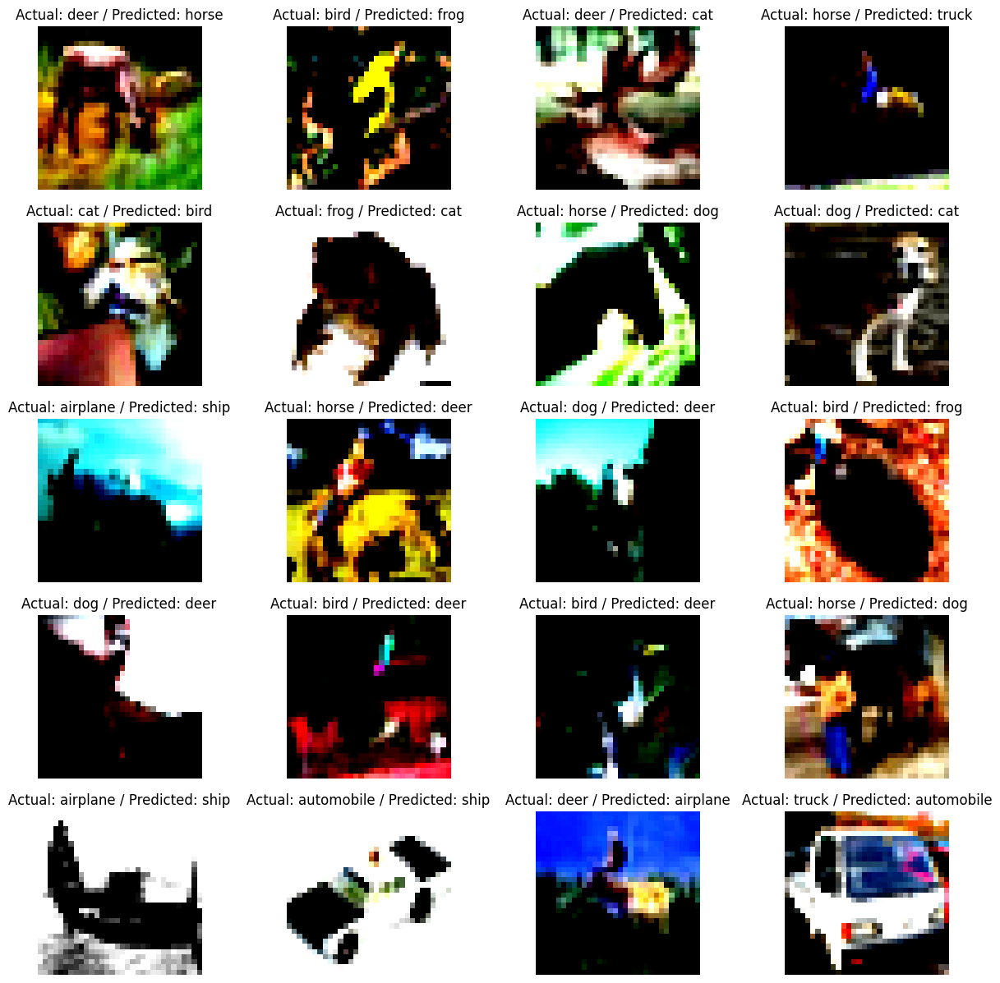
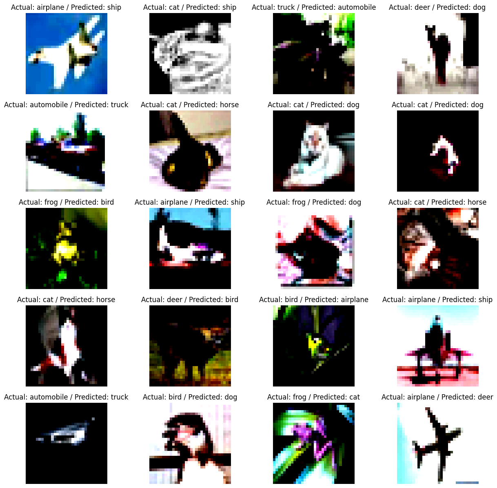
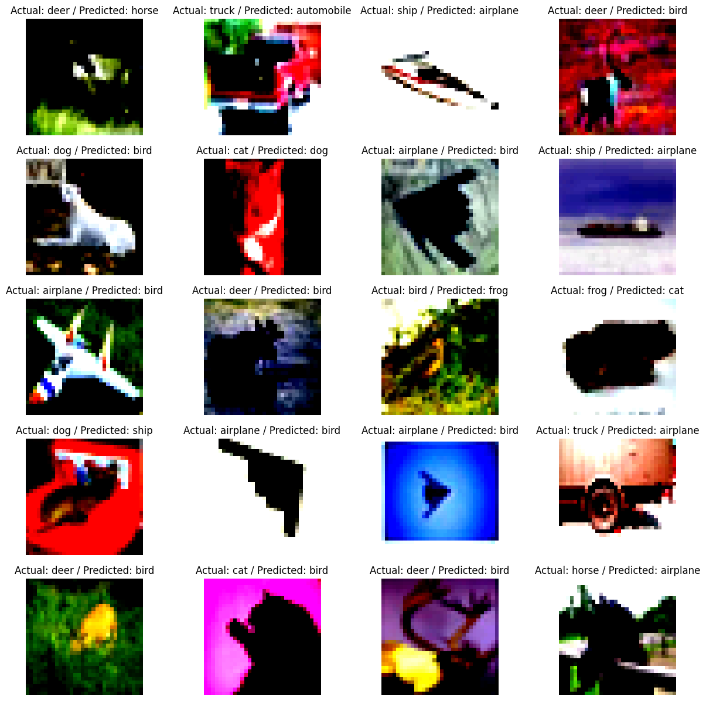
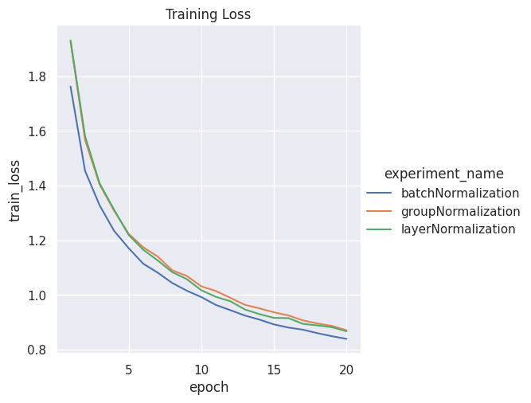
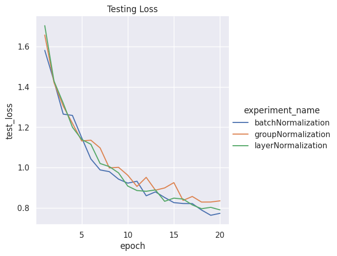

# Normalization Techniques for Neural Networks

This project explores various normalization techniques used in deep learning, specifically for Convolutional Neural Networks. The primary objective is to evaluate and compare the impact of different normalization methods on model performance and training stability. 

The Python script utilizes PyTorch to implement the Neural Network model and evaluates it using different normalization techniques: Batch Normalization, Group Normalization, and Layer Normalization.

The Neural Network code provided allows you to choose the type of normalization you want to use in the network.

## Collection of Misclassified Images
Here are some of the images that the models with different normalization techniques misclassified.

### Network with Group Normalization

### Network with Layer Normalization

### Network with Batch Normalization

## Training and Test Loss Comparison across three normalization technique

## Results of Experiments with Different Normalization Techniques in Convolutional Neural Networks

The following are the results of the experiment comparing three normalization techniques - batch normalization, group normalization, and layer normalization - on a simple convolutional neural network architecture. The normalization methods are applied to various convolutional layers. 

### Batch Normalization Experiment Results

#### Training Results

- Epoch:  16
  - Training Loss=0.9413061738014221 Batch_id=97 Accuracy=69.02%
  - Test set: Average loss: 0.8218, Accuracy: 7123/10000 (71.23%)
- Epoch:  20
  - Training Loss=0.8507381677627563 Batch_id=97 Accuracy=70.48%
  - Test set: Average loss: 0.7731, Accuracy: 7296/10000 (72.96%)

### Group Normalization Experiment Results

#### Training Results

- Epoch:  16
  - Training Loss=0.9273751378059387 Batch_id=97 Accuracy=67.65%
  - Test set: Average loss: 0.8372, Accuracy: 7129/10000 (71.29%)
- Epoch:  20
  - Training Loss=0.9484832286834717 Batch_id=97 Accuracy=69.70%
  - Test set: Average loss: 0.8350, Accuracy: 7121/10000 (71.21%)

### Layer Normalization Experiment Results

#### Training Results

- Epoch:  16
  - Training Loss=0.9670706391334534 Batch_id=97 Accuracy=67.95%
  - Test set: Average loss: 0.8439, Accuracy: 7023/10000 (70.23%)
- Epoch:  20
  - Training Loss=0.8663404583930969 Batch_id=97 Accuracy=69.44%
  - Test set: Average loss: 0.8241, Accuracy: 7104/10000 (71.04%)
 
## Conclusion
Overall, the normalization techniques play a significant role in model performance and stability. The right normalization method can improve the model's speed of convergence, generalization ability, and overall predictive performance.
